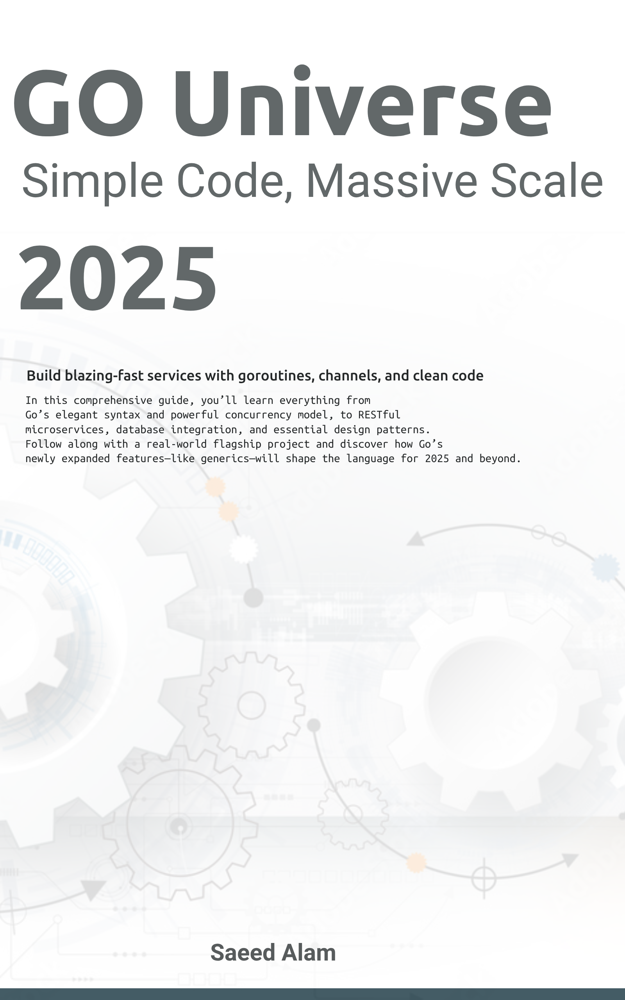

<div align="center">
  
  
  <h1 style="color: #00ADD8; margin-bottom: 0;">Go Universe</h1>
  <h3 style="color: #5DC9E2; margin-top: 10px; margin-bottom: 30px;">Mastering Simplicity, Unlocking Power</h3>
  
  <p style="font-size: 18px; max-width: 600px; margin: 0 auto 30px auto;">
    A comprehensive guide to Go programming from fundamentals to enterprise-scale applications
  </p>

  <p>
    <a href="https://saeedalam.github.io/go-universe">
      
    </a>
    <a href="https://github.com/saeedalam/go-universe/actions">
      
    </a>
    <a href="#book-structure">
      
    </a>
  </p>
  
  <a href="https://saeedalam.github.io/go-universe" style="display: inline-block; background-color: #00ADD8; color: white; font-weight: bold; padding: 12px 30px; text-decoration: none; border-radius: 6px; margin-top: 20px; box-shadow: 0 4px 6px rgba(0,0,0,0.1);">READ THE BOOK ONLINE</a>
</div>

<div align="center">
  <h2>🚀 Your Complete Go Programming Journey</h2>
</div>

**Go Universe** is a meticulously crafted learning path through the Go programming language, guiding you from your first "Hello, World!" to building scalable, concurrent systems like microservices, distributed applications, and cloud-native solutions.

With **36 chapters** organized in **8 logical sections**, this book provides both a structured learning path for beginners and a comprehensive reference for experienced developers seeking to master Go's elegant simplicity and powerful features.

<div align="center">
  <h2>✨ Key Features</h2>
</div>

<table>
  <tr>
    <td width="50%" style="padding: 15px; background-color: #f9f9f9; border-radius: 10px; vertical-align: top;">
      <h3>🔍 Comprehensive Coverage</h3>
      <p>From basic syntax to advanced topics like concurrency, microservices, and cloud-native development — everything you need to become a Go expert</p>
    </td>
    <td width="50%" style="padding: 15px; background-color: #f9f9f9; border-radius: 10px; vertical-align: top;">
      <h3>🛠️ Practical Examples</h3>
      <p>Clear, idiomatic code examples in every chapter that demonstrate Go's approach to clean, efficient programming</p>
    </td>
  </tr>
  <tr>
    <td width="50%" style="padding: 15px; background-color: #f9f9f9; border-radius: 10px; vertical-align: top;">
      <h3>🧪 Hands-on Projects</h3>
      <p>Build real-world applications as you progress, reinforcing concepts through practical implementation</p>
    </td>
    <td width="50%" style="padding: 15px; background-color: #f9f9f9; border-radius: 10px; vertical-align: top;">
      <h3>🔄 Latest Go Features</h3>
      <p>Stay current with the latest Go language features, ecosystem tools, and industry best practices</p>
    </td>
  </tr>
</table>

<div align="center">
  <h2 id="book-structure">📖 Book Structure</h2>
</div>

<details open>
<summary style="cursor: pointer; font-weight: bold; font-size: 18px; color: #00ADD8;"><strong>Section 1: Fundamentals</strong></summary>

<div style="padding-left: 20px;">

- **Chapter 1:** Introduction to Go
- **Chapter 2:** Essential Go Tooling
- **Chapter 3:** Variables, Constants, and Data Types
- **Chapter 4:** Operators and Expressions
- **Chapter 5:** Control Structures
- **Chapter 6:** Functions
- **Chapter 7:** Packages, Modules, and Error Handling
</div>
</details>

<details>
<summary style="cursor: pointer; font-weight: bold; font-size: 18px; color: #00ADD8;"><strong>Section 2: Data Structures</strong></summary>

<div style="padding-left: 20px;">

- **Chapter 8:** Arrays, Slices, and Strings
- **Chapter 9:** Maps and Pointers
- **Chapter 10:** Structs and Methods
</div>
</details>

<details>
<summary style="cursor: pointer; font-weight: bold; font-size: 18px; color: #00ADD8;"><strong>Section 3: Concurrency</strong></summary>

<div style="padding-left: 20px;">

- **Chapter 11:** Goroutines
- **Chapter 12:** Channels
- **Chapter 13:** Concurrency Patterns
</div>
</details>

<details>
<summary style="cursor: pointer; font-weight: bold; font-size: 18px; color: #00ADD8;"><strong>Section 4: Standard Library & Interfaces</strong></summary>

<div style="padding-left: 20px;">

- **Chapter 14:** Common Packages
- **Chapter 15:** File I/O
- **Chapter 16:** Testing
- **Chapter 17:** Interfaces
- **Chapter 18:** Reflection
- **Chapter 19:** Generics
</div>
</details>

<details>
<summary style="cursor: pointer; font-weight: bold; font-size: 18px; color: #00ADD8;"><strong>Section 5: Building Applications</strong></summary>

<div style="padding-left: 20px;">

- **Chapter 20:** Databases
- **Chapter 21:** Building RESTful APIs
- **Chapter 22:** Microservices
- **Chapter 23:** Clean Code
- **Chapter 24:** Design Patterns
- **Chapter 25:** Performance
- **Chapter 26:** CLI Tools
</div>
</details>

<details>
<summary style="cursor: pointer; font-weight: bold; font-size: 18px; color: #00ADD8;"><strong>Section 6: Enterprise Go</strong></summary>

<div style="padding-left: 20px;">

- **Chapter 27:** Platform Engineering
- **Chapter 28:** Event-Driven Architecture
- **Chapter 29:** Domain-Driven Design
- **Chapter 30:** Observability-Driven Development
- **Chapter 31:** Go for Production
- **Chapter 32:** Enterprise-Grade Security
</div>
</details>

<details>
<summary style="cursor: pointer; font-weight: bold; font-size: 18px; color: #00ADD8;"><strong>Section 7: Advanced Go</strong></summary>

<div style="padding-left: 20px;">

- **Chapter 33:** High-Performance Go
- **Chapter 34:** Cloud-Native Go
</div>
</details>

<details>
<summary style="cursor: pointer; font-weight: bold; font-size: 18px; color: #00ADD8;"><strong>Section 8: Specialized Domains</strong></summary>

<div style="padding-left: 20px;">

- **Chapter 35:** Go for AI and LLMs
- **Chapter 36:** Go for Blockchain and Crypto
</div>
</details>

<div align="center">
  <h2>📚 Reading Options</h2>
</div>

<div align="center">
  <table style="border-collapse: separate; border-spacing: 15px; margin: 0 auto;">
    <tr>
      <td align="center" style="padding: 20px; background-color: #f9f9f9; border-radius: 10px;">
        <br>
        <strong>Web (HTML)</strong><br>
        <a href="https://saeedalam.github.io/go-universe">
          
        </a>
      </td>
      <td align="center" style="padding: 20px; background-color: #f9f9f9; border-radius: 10px;">
        <br>
        <strong>PDF</strong><br>
        
      </td>
      <td align="center" style="padding: 20px; background-color: #f9f9f9; border-radius: 10px;">
        <br>
        <strong>EPUB</strong><br>
        
      </td>
    </tr>
  </table>
</div>

<div align="center">
  <h2>🔧 Building Locally</h2>
</div>

```bash
# Install mdBook if you haven't already
cargo install mdbook

# Clone this repository
git clone https://github.com/saeedalam/go-universe.git
cd go-universe

# Build the book
mdbook build

# Serve the book locally
mdbook serve --open
```

<div align="center">
  <h2>👥 Contributing</h2>
</div>

Contributions are welcome! If you find errors, have suggestions, or want to contribute content, please open an issue or submit a pull request.

<div align="center">
  <h2>📜 License</h2>
</div>

This book is licensed under the MIT License.

---

<div align="center">
  <p>
    <a href="https://www.linkedin.com/in/saeedvalam">Connect on LinkedIn</a>
  </p>
</div>
